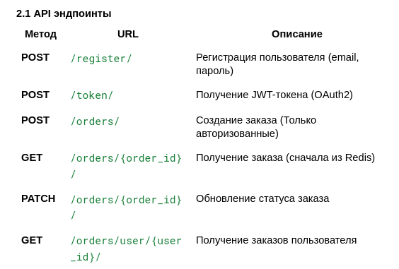

### Для запуска: 
1) переименовать .env.example в .env
2) запустить docker compose up

Тестовое:
Техническое задание: Разработка сервиса управления заказами
1. Введение
Разработать сервис управления заказами на FastAPI, поддерживающий аутентификацию, работу с очередями сообщений, кеширование и фоновую обработку задач.

2. Функциональные требования  
2.1 API эндпоинты
  
2.2 База данных (PostgreSQL)
Таблица orders:
- id (UUID, primary key)
- user_id (int, ForeignKey на пользователей)
- items (JSON, список товаров)
- total_price (float)
- status (enum: PENDING, PAID, SHIPPED, CANCELED)
- created_at (datetime)  
2.3 Очереди сообщений (Kafka / RabbitMQ)
При создании заказа публиковать событие "new_order" в очередь.
Консьюмер обрабатывает заказ и передает его в Celery.  
2.4 Redis (Кеширование заказов)
Если заказ запрашивается повторно – отдавать его из кеша (TTL = 5 минут).
При изменении заказа – обновлять кеш.  
2.5 Celery (Фоновая обработка)
Фоновая задача обработки заказа (time.sleep(2) и print(f"Order {order_id} processed")).  
2.6 Безопасность
JWT-аутентификация (OAuth2 Password Flow).
CORS-защита (ограничение кросс-доменных запросов).
Rate limiting (ограничение частоты запросов на API).
SQL-инъекции – только ORM-запросы.  

3. Нефункциональные требования
Использование FastAPI с Pydantic.
Работа с PostgreSQL через SQLAlchemy + Alembic.
Асинхронное взаимодействие с Kafka / RabbitMQ.
Docker Compose для развертывания всей инфраструктуры.
Код должен быть структурированным и документированным.

4. Инструкция по сдаче
Разместить код на GitHub / GitLab.
Описать установку и запуск в README.md.
Прислать ссылку на репозиторий.
Обязателен SwaggerUI

